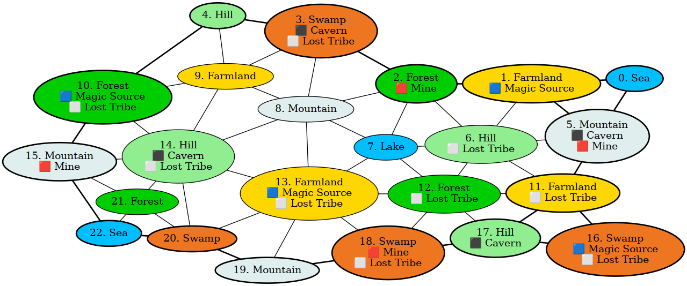

# smawg

Python backend for
[Small World](https://en.m.wikipedia.org/wiki/Small_World_(board_game))
board game,
designed for writing third-party AIs and clients around it.

It has a bundled CLI client for interactive use
and easy interoperability with other programming languages.

## Features

* High level API for performing in-game actions and getting current stats.
    * Imperatively or by setting hooks on game events.
* Automatic maintainance of game state (manages tokens, calculates score, etc).
* Automatic checks for violation of the rules.
    * The rule checker is exposed, so you can also "dry run" an action to check
    if it's valid.
* Support for custom maps, races and other assets.
* Support for custom rules (see [docs/rules.md](docs/rules.md)).
* Deterministic or randomized outcomes.

### Missing features

* Unique effects for each Race and Special Power.

### Future plans

* Options for more machine-readable CLI output.
* In-house AI and GUI examples.
* Better support for expansions.

## Requirements

* Python 3.11+ (currently, only 3.11 is tested)
* [pydantic](https://github.com/pydantic/pydantic)
* [tabulate](https://github.com/astanin/python-tabulate) (for `smawg play`)
* [graphviz](https://github.com/xflr6/graphviz) (for `smawg viz`)

## Releases

See [CHANGELOG.md](./CHANGELOG.md) for the list of releases.
To get the latest stable release, clone from the `master` branch.

## Installation

```sh
git clone -b master https://github.com/Expurple/smawg.git
cd smawg/

# User wide install if your OS allows it:
python3 -m ensurepip
pip install --user .

# Or install into `venv`:
python3 -m venv venv
source venv/bin/activate
pip install .
```

## Usage

### As a CLI app

You can play the game at the command line, using the bundled client.

A simple set of options to get you started:

```bash
python3 -m smawg play --relative-path assets/tiny.json
```

It should guide you through the usage. See `--help` for more details.

### As a library

```python
import json

from smawg import Game

# If you want, you can directly construct `assets` as dict or Assets object
# instead of reading from file.
with open('some/path/to/assets.json') as assets_file:
    assets = json.load(assets_file)
assets = assets.shuffle()  # If you need to.

# Provide additional arguments or set hooks on game events, if needed.
# See `docs/hooks.md` for more info about hooks.
game = Game(assets)

# Call `game` methods to perform actions.
# Read `game` properties to monitor the game state.
# See `help(Game)` for more info.
```

You can also find "real world" usage examples in
[smawg/cli.py](./smawg/cli.py) and [smawg/tests/](./smawg/tests/)

## Assets

`smawg` usually gets static assets (like a list of races) from a JSON file.

The following sets of assets are provided in `smawg/assets/`:

* `standard_*_players.json` -
    the standard setups for 2, 3, 4 and 5 players respectively.
* [tiny.json](smawg/assets/tiny.json) -
    a small setup for testing.

You can create and use your own asset files.
You're not required to contribute them back, but I would appreciate it.

### JSON schema

For better editing experience (at least in VSCode),
you can generate a JSON schema:

```sh
python3 -m smawg schema > assets_schema.json
```

And then reference it in your assets file:

```json
"$schema": "some/path/to/assets_schema.json",
```

The nice thing about this is that you can make an edit to `smawg`'s source code
and then instantly generate a new schema that reflects your changes.

### Visualization

Assets don't specify a visual layout for game maps, because it doesn't matter
to the backend. I imagine the map from [tiny.json](./smawg/assets/tiny.json) as
`I`, but `II` and `III` are exactly the same from `smawg`'s point of view:

```text
    I                II               III
+-------+        +-------+        +---------+
| 0 | 1 |        | 1 ^ 0 |        | 4 |   3 |
|   ^   |        |  / \  |        |   ^     |
|  / \  |        |-< 2 >-|        |  / \    |
|-< 2 >-|        |  \ /  |        |-< 2 >---|
|  \ /  |        |   v   |        |  \ /    |
|   v   |        | 4 | 3 |        |   v     |
| 3 | 4 |        |   |   |        | 1 |   0 |
+-------+        +-------+        +---------+
```

It may be hard to imagine larger maps in your head.
`smawg viz` utility allows to always have an accurate picture.
Typical usage:

```bash
python3 -m smawg viz --view some/path/to/assets.json
```

As of 0.19.0, here's how `smawg viz` renders
[standard_2_players.json](./smawg/assets/standard_2_players.json):



## Contributing

Feel free to open a
[Github issue](https://github.com/Expurple/smawg/issues/new/choose)
or contact me personally.

If you wish to participate in development, this should get you started:

```sh
# <Fork this repo on Github>
git clone git@github.com:YOUR-USERNAME/smawg.git
cd smawg/
python3 -m venv venv
source venv/bin/activate
pip install .[dev] && pip uninstall smawg # Install only dependencies
bin/add-pre-commit-hook.sh
```

Any contributions are welcome, but [missing featues](#features) and
[open issues](https://github.com/Expurple/smawg/issues) should be prioritized.

Before submitting a pull request, please test and document your changes.

Tests can be run using

* the standard library's `python3 -m unittest discover smawg/tests/`
* or any other test runner that supports `unittest` format.

## Contacts

* **Home page** - [smawg](https://github.com/expurple/smawg)
* **Author** - Dmitrii Aleksandrov <adk230@yandex.ru\>

## License

Copyright (c) 2022 Dmitrii Aleksandrov.

Licensed under [GPL v.3 or later](./LICENSE)

This copyright only applies to the code and other documents in this repository,
**not** the concept, title or any other property of the original game.
